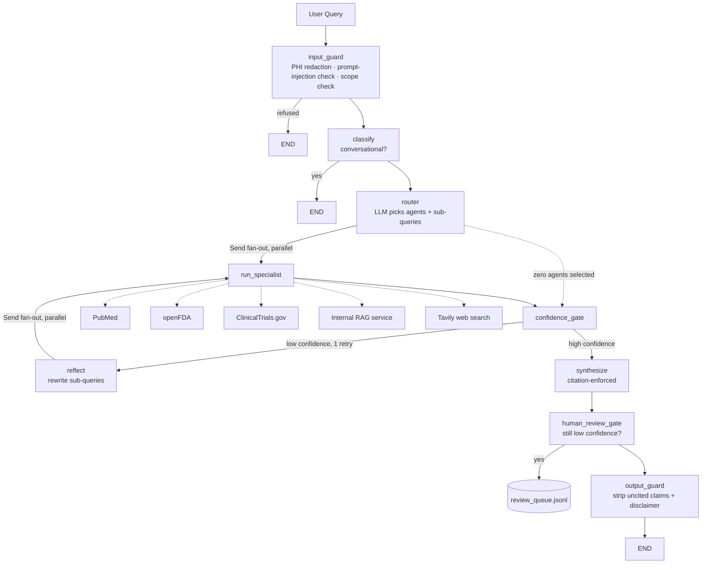

# Multi-Agent Clinical Research Assistant

A LangGraph multi-agent system that answers clinical research questions by orchestrating five healthcare specialists — PubMed, openFDA, ClinicalTrials.gov, an internal RAG service, and live web search — with PHI redaction, an LLM-as-judge eval harness gating CI, full observability, and tiered-model cost optimization.

**Live demo:** https://multi-agent-clinical-api.purplemeadow-1cdc7a19.eastus.azurecontainerapps.io ([`/health`](https://multi-agent-clinical-api.purplemeadow-1cdc7a19.eastus.azurecontainerapps.io/health), `POST /query`) — Azure Container Apps, scale-to-zero, so the first request after idle may take a few seconds to cold-start.

```bash
curl -X POST https://multi-agent-clinical-api.purplemeadow-1cdc7a19.eastus.azurecontainerapps.io/query \
     -H "Content-Type: application/json" \
     -d '{"query": "What are the warnings for metformin?"}'
```

**Repo:** https://github.com/YaminiChowdaryBellam/MULTI-AGENT-SYSTEM

---

## The problem

A clinician or researcher asking "what are the treatment options for atrial fibrillation, and are there interactions between warfarin and amiodarone?" needs an answer that draws on several distinct, authoritative sources at once — published literature, an official drug label, and active trials — not a single search engine's best guess. A general-purpose chatbot either hallucinates specifics or can't reach any of these sources. This project builds the orchestration layer a real clinical-research assistant needs: route each question to the specialists that can actually answer it, synthesize their findings into one cited answer, and refuse to guess when the evidence isn't there — all while keeping PHI out of every downstream system, including the observability tooling.

## Architecture



Every node is Langfuse-traced (latency, token cost, routing/retry metadata); every request is appended to a replayable JSONL audit log; the whole graph is checkpointed per-session so follow-up questions keep context.

## Implementation

| Layer | What it does |
|---|---|
| **Specialists** (`agents/`, `tools/`) | One agent + one API client per source — PubMed (NCBI E-utilities), openFDA (drug labels), ClinicalTrials.gov (v2 API), an internal RAG service, Tavily (live web) |
| **Agentic core** (`graph/`) | LangGraph `StateGraph`: parallel specialist fan-out via `Send`, a confidence-gated reflection retry (max 1), checkpointed sessions, PHI/injection/scope guardrails, citation enforcement, human-in-the-loop review queuing |
| **Model tiering** (`graph/llm.py`) | Routing + guard-check calls go to a quantized local model (Llama-3.2-3B via Ollama) when `TIERED_MODELS=true`; synthesis always uses Groq's hosted model |
| **Evals** (`evals/`) | 50-query gold-set routing accuracy, LLM-as-judge faithfulness + citation coverage, an LLM-vs-embedding-router A/B experiment, cross-version regression tracking |
| **Ops** (`api.py`, `.github/workflows/`) | FastAPI service (`POST /query`, `GET /health`), Docker/Compose, CI that fails a PR when routing accuracy or faithfulness regresses |

Full build history, design rationale, and every bug found along the way live in [`PROJECT_NOTES.md`](PROJECT_NOTES.md).

## Measured impact

**Routing accuracy & faithfulness** ([`evals/results/`](evals/results/), tracked per commit):

| Metric | Value |
|---|---|
| Routing accuracy (exact agent-set match, 50-query gold set) | **70%** (74% after two mislabeled gold-set entries were corrected — see `PROJECT_NOTES.md`) |
| Routing precision / recall / F1 | 81% / 89% / 84% |
| Faithfulness (LLM-as-judge, evidence-grounded) | **85%** |
| Citation coverage | 100% |

**LangGraph parallel fan-out vs the original sequential orchestrator** (same demo query, `agents/orchestrator.py --legacy` vs the graph):

| Engine | Latency |
|---|---|
| Sequential (legacy hand-rolled orchestrator) | 68.1s |
| Parallel (LangGraph `Send` fan-out) | 35.5s (**~2x faster**) |

**LLM router vs embedding-similarity router** (Step 5.4 A/B experiment, `python -m evals.ab_experiment`, 50 queries):

| Variant | Accuracy | F1 | Mean latency | Total cost |
|---|---|---|---|---|
| LLM router (Groq) | 72% | 86% | ~5.0s | $0.0016 |
| Embedding router (local `sentence-transformers`) | 34% | 51% | ~0.05s (**~100x faster**) | $0.00 |

**Model tiering: cost vs latency trade-off** (Step 6.1, `python -m evals.tiering_benchmark`, 5 queries, full graph):

| | Before (all-Groq) | After (tiered — Ollama for routing/guards) |
|---|---|---|
| Mean latency/query | 19.46s | 26.73s |
| Mean cost/query | $0.00012 | $0.00005 |
| **Cost reduction** | | **59.5%** |

Tiering cuts LLM cost by more than half, but the quantized 3B model running on local CPU is slower per call than Groq's hardware-accelerated hosted inference — so this is a genuine trade-off (cost vs latency), not a pure win. Worth it if you're cost-constrained and latency-tolerant; not if the reverse is true.

**CI regression gate** (Step 5.3): a PR that reverted the router's prompt to an earlier, over-inclusive version (measured 4% routing accuracy vs. the 70% baseline) was correctly caught and blocked by CI's eval harness step — [PR #1](https://github.com/YaminiChowdaryBellam/MULTI-AGENT-SYSTEM/pull/1). Lint and unit tests passed; only the eval harness — comparing against the committed baseline — caught the regression.

## Running it

```bash
pip install -r requirements.txt
python -m spacy download en_core_web_sm
cp .env.example .env   # fill in GROQ_API_KEY, TAVILY_API_KEY

python main.py                 # CLI, LangGraph engine
python main.py --legacy        # CLI, original hand-rolled orchestrator
uvicorn api:app --port 8001    # HTTP API
docker compose up              # containerized

pytest tests/ -q                        # 100 tests
python -m evals                         # routing + faithfulness evals
python -m evals.ab_experiment           # LLM vs embedding router
python -m evals.tiering_benchmark       # cost/latency before vs after tiering
```

Optional: `TIERED_MODELS=true` + a local `ollama serve` running `llama3.2:3b` routes routing/guard-check calls to the local model instead of Groq.

## Project structure

See [`PROJECT_NOTES.md`](PROJECT_NOTES.md) for the full directory layout, phase-by-phase design log, and every bug the eval harness and CI caught along the way (there were several — that's the point of building them).
